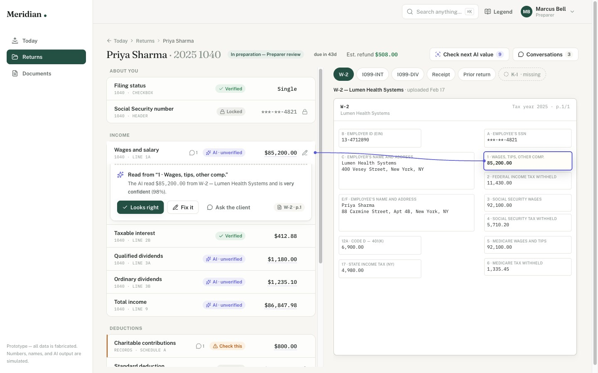

# Meridian — every number has a receipt

A working prototype of an AI-powered tax platform for clients and the CPA firms
who serve them, built for the **AI Engineer case study** ("Designing an
AI-Powered Tax Platform From Scratch"). One cohesive product, two lenses: a calm,
plain-English experience for clients, and a deep, traceable workspace for
preparers.

**Live demo:** _add your Vercel URL here_ · **Video walkthrough:** _add your
Loom/recording link here_



## The 60-second tour

1. **Pick a hat** on the landing page — Priya (client) or Marcus (preparer).
2. **As Marcus:** the *Today* queue says what to work on and *why* → open Priya
   Sharma → click **Wages and salary** → a thread draws from the field to Box 1
   of her W-2, with a receipt-style card: what the AI read, how sure it is, and
   what to do about it → open **Charitable contributions** (amber, 62%
   confident, handwritten receipt) → *Fix it* → the correction is recorded and
   the AI's original stays on file.
3. **As Priya:** "2 things need you · about 4 min" → upload the missing K-1 and
   watch it get read → answer Marcus's question about the donation with one tap.
   She never sees confidence scores, substages, or internal notes.

## Challenges covered → where to look

| # | Challenge | Where it lives | The one-line decision |
|---|-----------|----------------|----------------------|
| 01 | Source traceability | Review workspace | Click any value → a drawn thread + highlighted box on the source document; calculations chain (click an input to keep tracing) |
| 02 | Client & CPA collaboration | Conversations panel · client "Questions for you" | Threads pin to fields/documents, are marked *Firm only* vs *Client can see*, and outstanding requests are tracked — grouped by whose move it is, with age |
| 03 | Where to start | Client home | One card: what needs you, how long it takes, in minutes — and the interface visibly changes as onboarding completes (finish both tasks and the checklist gives way to status) |
| 04 | Getting lost | Everywhere | URL-deep-linkable state, breadcrumbs, thread→field jumps, and a "Back to Priya's return" chip that survives any detour |
| 05 | Role-aware experiences | Role picker · persona menu · staff gate | Six personas, one shell: client, business owner, preparer, reviewer, firm admin, seasonal staff. Each lands on its own default (reviewer → review queue, admin → whole firm, seasonal → own returns only, with the limitation stated); a client hitting a firm URL gets a plain explanation, not a 404; Marcus wears his client hat for his own return |
| 06 | Status & progress | Client journey card · staff stage badges | One state machine, two renderings: five plain-English steps for clients, substages for staff |
| 07 | Actionable dashboard | Staff *Today* | Real ranking logic (deadlines, unread replies, AI flags, blocked days) over ~120 returns — every card shows its reasons and one next action, and firm scope adds a workload-by-preparer strip for managers |
| 08 | Clickable vs. editable | The affordance system (Legend, top right) | Six states — AI·unverified / Check this / Needs approval / Verified / Edited / Locked — same marks on every screen; pencils appear only where editing is allowed; locks explain themselves |
| 09 | Complexity made navigable | Documents (~950 seeded) · ⌘K search | Fold by client, cap what renders, cut with filters, narrow by typing; summary lists one click above full detail |
| 10 | Trustworthy AI | AI review notes · provenance cards · client copy | Recommendations and warnings with the why, evidence chips that highlight the exact box, and uncertainty in words; corrections keep the AI's original on record; clients get plain words, never percentages |

## What's real vs. simulated

**Real (working code):**
- Every interaction above: tracing, correction/verify flows, threads and
  visibility rules, prioritization scoring, search, filters, deep links, role
  switching, the upload state machine
- The dataset: ~120 returns and ~950 documents generated deterministically
  (seeded PRNG) so edge cases are guaranteed present — a 62%-confidence
  extraction, a client-reported value awaiting approval, a locked filed
  return, returns blocked on clients for days, overdue deadlines, empty
  states
- Onboarding progress is shared across pages: uploading the K-1 or answering
  the question updates the home checklist, the nav badge, and "what's next"
- A typed mock-API layer (`src/lib/api.ts`) with simulated latency — screens
  show real loading and error states

**Simulated (by design — the brief asks for it):**
- OCR/document parsing: source documents are HTML renderings with hardcoded
  box coordinates; "the AI read Box 1" is fabricated provenance data
- AI confidence scores and notes: hand-authored to exercise the trust UI
- Auth: the persona switcher stands in for login; permissions are enforced in
  the API layer (clients never receive internal threads), not by real auth
- Persistence: corrections and replies live in React state; refresh resets them
- The clock: the app lives on a fixed "today" (March 2, 2026) so deadlines read
  realistically

## Key design decisions (and why)

- **"Every number has a receipt."** Trust in AI output is the product's core
  problem, so provenance is the hero interaction, not a tooltip. The trace
  thread makes the connection literal.
- **Clients never see confidence scores.** A percentage creates doubt without
  giving a client any action. They see "we read this from your W-2 — does this
  look right?"; the 62% lives on the preparer's side.
- **One state machine, two vocabularies.** Status confusion comes from showing
  everyone the same words. The data model stores one state; the client and
  staff views render it differently on purpose.
- **The dashboard ranks, and says why.** Reason chips ("Deadline in 4 days",
  "Client replied — unread") are the anti-spreadsheet: a queue you can trust
  without rebuilding it yourself.
- **Affordance states are data, not styling.** `ai_generated | needs_review |
  verified | edited | locked` live on the field model; the UI renders them
  identically everywhere, and the Legend documents the language in-product.
- **Corrections don't argue.** Fixing an AI value takes one input; the original
  extraction stays visible on the record. The AI never defends itself.

## Run locally

```bash
pnpm install
pnpm build && pnpm start   # or: pnpm dev
```

Node 20+. No environment variables, no database — everything is seeded.

## Deploy

Push to GitHub and import into Vercel (zero config), or:

```bash
npx vercel --prod
```

## Path to production

The mock layer is shaped like the real thing so the swap is mechanical:

```
Next.js (unchanged UI)
   │  src/lib/api.ts  ←— the only file that changes
   ▼
FastAPI on Cloud Run ── Pydantic models mirroring src/data/types.ts
   ├── Supabase Postgres  · returns, fields+provenance, threads, tasks
   │     └── RLS policies  · internal-vs-client visibility enforced in the DB
   ├── Supabase Storage / GCS · original documents
   └── Extraction workers (Cloud Run jobs) · OCR + LLM extraction writing
         {value, source box, confidence} — the exact provenance shape the UI
         already renders
```

Auth becomes Supabase Auth (client magic links, firm SSO); the persona switcher
disappears; row-level security replaces the API-layer filtering. The
prioritization scorer moves server-side unchanged.

## With another week

Reviewer and admin as first-class views (they're stubs today), real PDF
rendering with box overlays, questionnaire flow, notifications/nudges, e-sign
for client approval, and a proper audit log page built on the provenance data.

---

*All names, numbers, firms, and AI output are fabricated. Built with Next.js,
Tailwind, and TypeScript; typography is Fraunces, Public Sans, and IBM Plex
Mono.*
